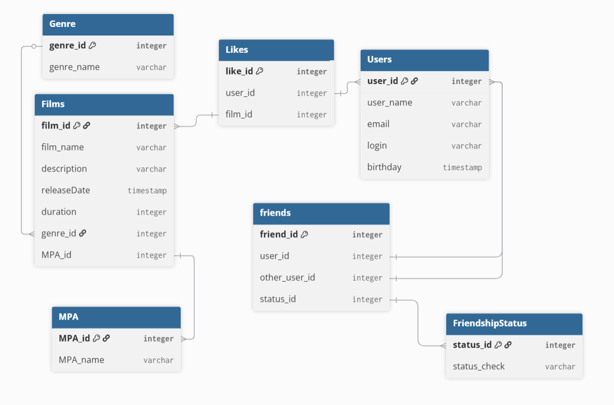

# java-filmorate
Template repository for Filmorate project.

Схема реляционной базы данных для filmorate.


Для данной БД можно использовать такие запросы:
Для Film:
- Найти все фильмы - getFilms()
   ```SQL
   SELECT *
   FROM Films;
   ```
- Найти фильм по id - findFilmById()
   ```SQL
   SELECT *
   FROM Films
   WHERE film_id = {введите id};
   ```
- Найти популярный фильм - getPopular()
   ```SQL
   SELECT 
        film.name,
        COUNT(likes.film_id) AS count_likes
   FROM Films AS films
   LEFT JOIN Likes AS likes ON films.film_id = likes.film_id;
  GROUP BY film.name
  OREDER BY count_likes DESC
  LIMIT 1; 
  ```
Для User:
- Найти всех пользователей - getUsers()
   ```SQL
   SELECT *
   FROM Users;
   ``` 
- Найти пользователя по id - findUserById()
   ```SQL
   SELECT *
   FROM Users
   WHERE user_id = {введите id};
   ```
